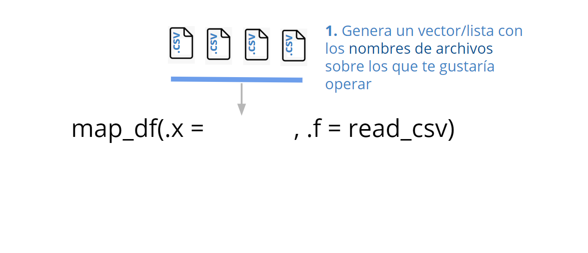
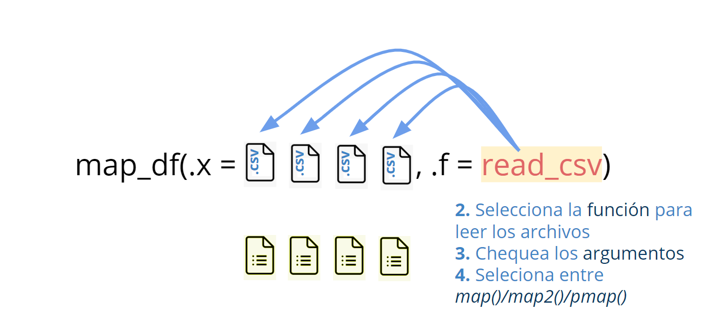
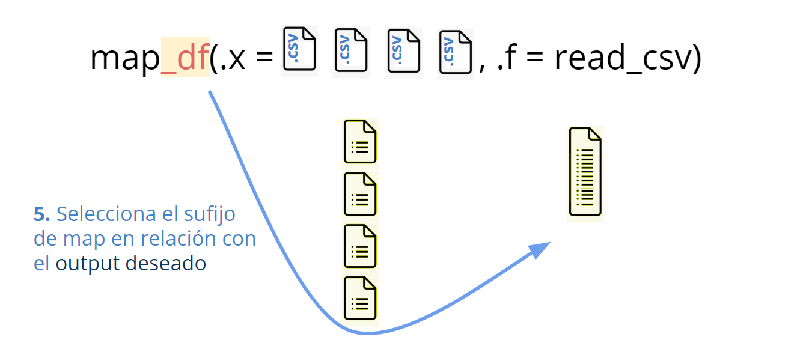
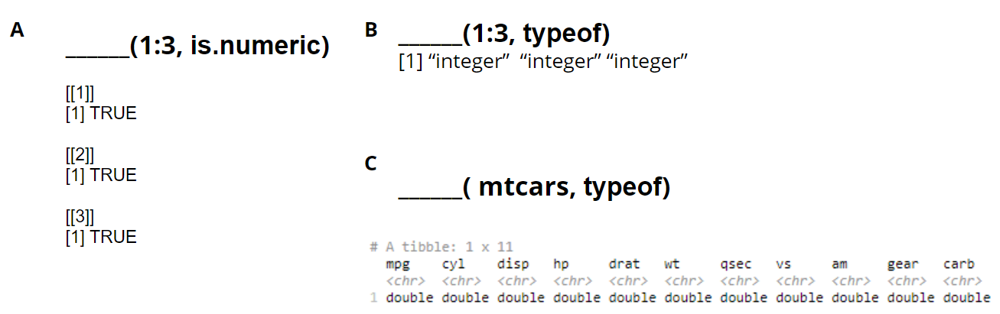
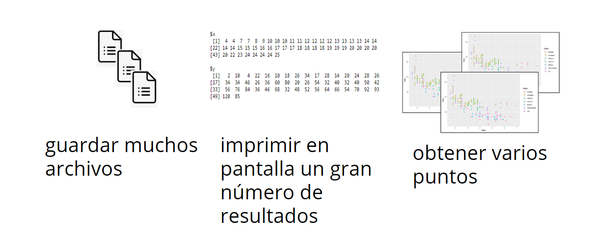
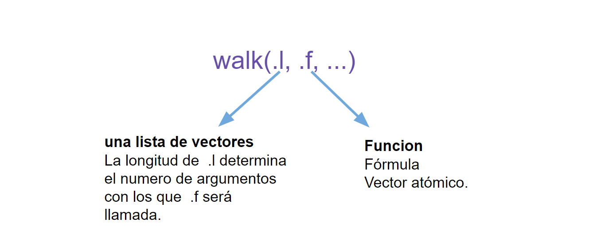
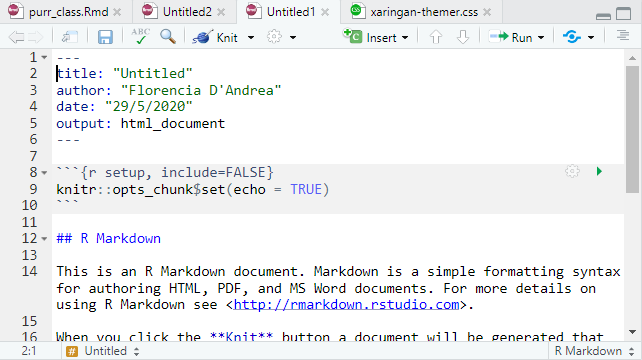
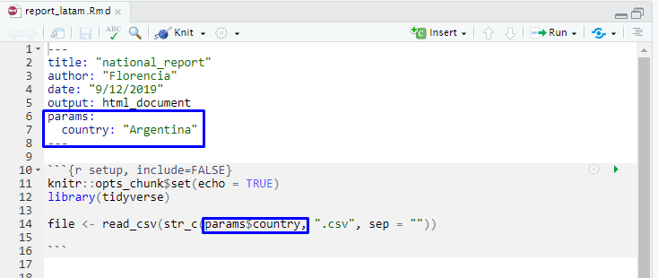
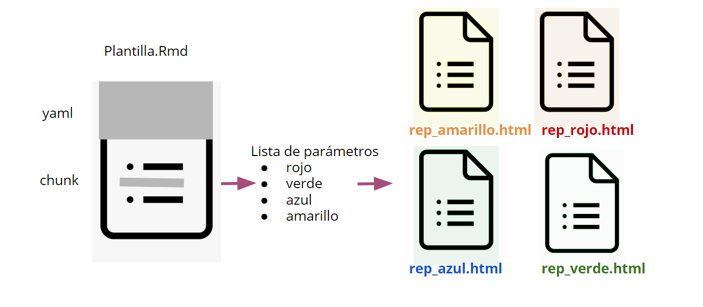
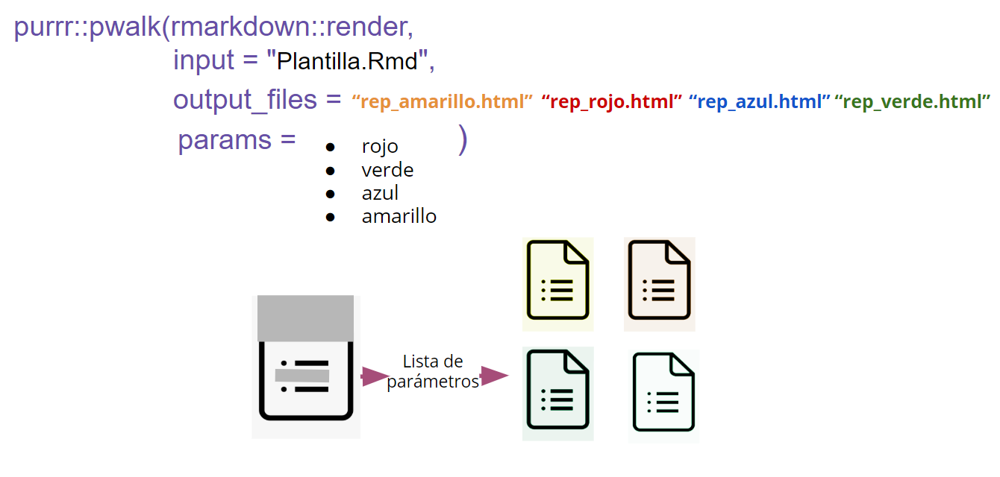

```{r xaringan-themer, include=FALSE, warning=FALSE}
library(xaringanthemer)
style_mono_accent(
  base_color = "#1037A0",
  inverse_background_color = "#16a67a",
  header_font_google = google_font("Josefin Sans"),
  text_font_google   = google_font("Montserrat", "300", "300i"),
  code_font_google   = google_font("Fira Mono")
)

```

```{r setup, include=FALSE}
options(htmltools.dir.version = FALSE,
        fig.align='center')
library("showtext")
```

class: center, middle

# Iteración con el paquete purrr

### para el manejo automatizado de archivos

### 📄🐱

---
class: inverse, center, middle

### 1. Obtener un único dataframe de multiples archivos
 
### 2. Automatizar la creación de reportes


---
class: inverse, center, middle

### 👉<span style="color: #f2cc9d;">1. OObtener un único dataframe de multiples archivos</span> 
 
### 2. Automatizar la creación de reportes

---

### Leer archivos usando `map_df()`

```{r one, echo = FALSE}

```

---

### Leer archivos usando `map_df()`

```{r two, echo = FALSE}

```

---

### Leer archivos usando `map_df()`

```{r three, echo = FALSE}

```

---
# Practiquemos 💪
### ¿Qué función usarías para obtener los siguientes valores de retorno?

1. `map()`
2. `map_df()`
3. `map_chr()`


```{r four, echo = FALSE}

```


---
class: inverse, center, middle

# Demo #1 💻

#### 1. Construi un vector con `nombres de archivos` sobre los cuales iterar
#### 2. Seleccioná una `función` para leer los archivos
#### 3. Chequea el número de `argumentos` que la función necesita
#### 4. Elegí entre `map()`/`map2()`/`pmap()`
#### 5. Elegi un sufijo para  `map_*()` en relación al output deseado

File `live_coding.R` in [](https://mybinder.org/v2/gh/flor14/purrr_class/master?urlpath=rstudio)

---

class: inverse, center, middle

### 1. Obtener un único dataframe de multiples archivos
 
### 2. Automatizar la creación de reportes 
---

class: inverse, center, middle

### 1. Obtener un único dataframe de multiples archivos
 
### 👉 <span style="color: #f2cc9d;">2. AAutomatizar la creación de reportes</span> 
---

### Iterar usando una funcion por sus efectos colaterales

```{r five, echo = FALSE}

```

---
### Función `purrr::walk()` 

```{r six, echo = FALSE, out.width=500}

```

---

# Practiquemos 💪
### Cuál de estas funciones usarías con la familia de funciones walk()?
1. `purrr::safely()`
2. `~ggplot(., aes(mpg, wt)) + geom_point()`
3. `rmarkdown::render()`
4. `~list(name = .)`

¿Podés explicar la elección de usar `map()` o `walk()` para iterar con estas funciones?

---

### RMarkdown 🧶 

```{r rmark, echo = FALSE, out.width=700}

```

---

### RMarkdown Template file

Incluí parámetros en el código

```{r eight, echo = FALSE}


```

---

### Automatización de la creación de reportes

```{r seven, echo = FALSE}

```

---

### `pwalk()` 🧶😺

```{r final, echo = FALSE}

```

---

class: inverse, center, middle

# Demo #2 💻

¡Obtene tu propia serie de reportes!

Archivo `live_coding.R` en
[](https://mybinder.org/v2/gh/flor14/purrr_class/master?urlpath=rstudio)

---

class: center, middle

# ¡Gracias!

### 😺🧶😺🧶😺🧶

Slides created via the R package [**xaringan**](https://github.com/yihui/xaringan).

